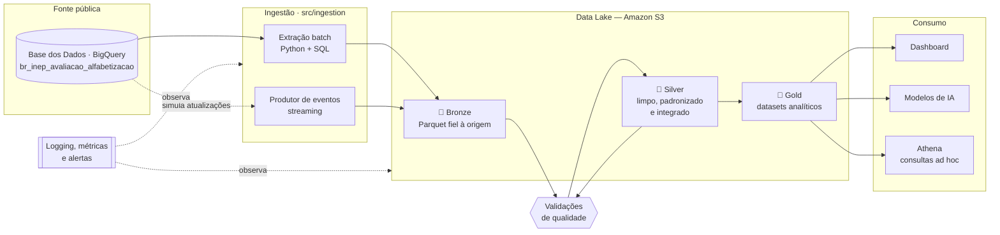

# Indicador Criança Alfabetizada — Pipeline Híbrida de Dados

**Tech Challenge · Fase 2 — FIAP AI Scientist**

Pipeline de dados híbrida (batch + streaming) em nuvem, construída sobre Arquitetura Medalhão (Bronze → Silver → Gold), para integrar, tratar e disponibilizar os dados do **Indicador Criança Alfabetizada** — a métrica oficial que acompanha o percentual de estudantes alfabetizados ao final do 2º ano do Ensino Fundamental.


> **Legenda de status:** ✅ concluído · 🚧 em andamento · ⏳ planejado
> **Documentação:** este README apresenta para o projeto: problema, arquitetura, decisões, execução e evidências.

---

## Sumário

1. [O problema](#1-o-problema)
2. [A solução em uma página](#2-a-solução-em-uma-página)
3. [Fonte de dados](#3-fonte-de-dados)
4. [Arquitetura](#4-arquitetura)
5. [Infraestrutura como código](#5-infraestrutura-como-código)
6. [Decisões arquiteturais e trade-offs](#6-decisões-arquiteturais-e-trade-offs)
7. [As camadas do data lake](#7-as-camadas-do-data-lake)
8. [Contrato da camada Silver](#8-contrato-da-camada-silver)
9. [Qualidade de dados](#9-qualidade-de-dados)
10. [Orquestração](#10-orquestração)
11. [Ingestão em streaming](#11-ingestão-em-streaming)
12. [Observabilidade e monitoramento](#12-observabilidade-e-monitoramento)
13. [Análise exploratória](#13-análise-exploratória)
14. [FinOps — custo e otimização](#14-finops--custo-e-otimização)
15. [Aplicação em IA e políticas públicas](#15-aplicação-em-ia-e-políticas-públicas)
16. [Como executar](#16-como-executar)
17. [Evidências de execução](#17-evidências-de-execução)
18. [Estrutura do repositório](#18-estrutura-do-repositório)
19. [Fluxo de trabalho Git](#19-fluxo-de-trabalho-git)
20. [Roadmap e status](#20-roadmap-e-status)
21. [Equipe](#21-equipe)
22. [Licença](#22-licença)

---

## 1. O problema

O Brasil assumiu o compromisso de alfabetizar **todas as crianças até o final do 2º ano do Ensino Fundamental até 2030**. Para medir o avanço, o INEP aplica uma avaliação padronizada e considera alfabetizado o estudante que atinge **743 pontos na escala Saeb de Língua Portuguesa**.

O desafio de dados não está em coletar a informação — ela é pública. Está em **integrá-la e mantê-la confiável ao longo do tempo**. Os resultados por aluno, as metas por ente federativo e as dimensões territoriais são tabelas distintas, com granularidades distintas, produzidas em momentos distintos. Cruzá-las exige normalizar códigos territoriais, conciliar representações diferentes da mesma rede de ensino e decidir o que fazer quando duas fontes discordam sobre o mesmo número.

Sem uma camada integrada, cada análise vira retrabalho manual: alguém consulta a base, monta um cruzamento em planilha, chega a um número — e ninguém consegue reproduzir aquele número três meses depois. **Gestores educacionais não conseguem responder perguntas simples de forma confiável e recorrente:** quais municípios estão abaixo da meta, onde o avanço estagnou, quais redes melhoraram e quanto.

Esta pipeline resolve esse gargalo. Transforma dados públicos brutos em uma camada analítica versionada, validada e reprodutível, pronta para consumo por dashboards, análises estatísticas e modelos de IA.

---

## 2. A solução em uma página

| Dimensão | O que entregamos |
|---|---|
| **Ingestão** | Extração programática das tabelas públicas via BigQuery (batch) + produtor de eventos simulando atualizações do indicador (streaming) |
| **Armazenamento** | Data lake em Amazon S3 em Arquitetura Medalhão, com dados em Parquet particionado |
| **Tratamento** | Padronização de esquemas, normalização de chaves territoriais, tipagem correta e integração das entidades |
| **Qualidade** | Validações automatizadas com relatório versionado a cada execução — registro reprovado vai para quarentena, não é descartado em silêncio |
| **Camada Gold** | Datasets analíticos prontos: indicador por município, meta × resultado, série temporal e tabela de features para ML |
| **Operação** | Logging estruturado, métricas de execução e alertas de falha |
| **FinOps** | Arquitetura serverless, formato colunar particionado e estimativa de custo mensal documentada |

**O diferencial da entrega é a reprodutibilidade.** Qualquer avaliador clona o repositório, configura as credenciais e reconstrói a pipeline inteira do zero com um comando. Nenhuma etapa depende de download manual, planilha local ou arquivo que alguém precisa mandar por e-mail.

---

## 3. Fonte de dados

Todas as entidades vêm de uma única fonte: o dataset público **`basedosdados.br_inep_avaliacao_alfabetizacao`**, hospedado no BigQuery pela plataforma [Base dos Dados](https://basedosdados.org/).

O INEP é o **produtor** do dado; a Base dos Dados é o **meio de acesso** — ela publica os microdados oficiais já tratados, tipados e consultáveis via SQL. A extração acontece em `src/ingestion/extract.py`.

| Tabela | Conteúdo | Grão | Destino na Bronze |
|---|---|---|---|
| `uf` | Indicador agregado por unidade federativa | UF × ano | `data/bronze/alfabetizacao/` |
| `municipio` | Dimensão territorial de municípios | Município | `data/bronze/municipios/` |
| `alunos` | Resultados no nível do estudante | Aluno | `data/bronze/alunos/` |
| `meta_alfabetizacao_brasil` | Meta nacional | País × ano | `data/bronze/metas_brasil/` |
| `meta_alfabetizacao_uf` | Meta por unidade federativa | UF × ano | `data/bronze/metas_uf/` |
| `meta_alfabetizacao_municipio` | Meta por município | Município × ano | `data/bronze/metas_municipios/` |
| `dicionario` | Dicionário de dados das tabelas | Coluna | `data/bronze/dicionario/` |

**O código IBGE de município (7 dígitos) é a espinha dorsal da integração.** Todas as entidades territoriais convergem nele, e por isso ele é tratado como *string* em toda a pipeline — preservar zeros à esquerda e a semântica de código, não de número, é pré-requisito para o join funcionar. A regra precisa valer para todas as chaves, sem exceção silenciosa.

**Por que uma fonte única e não várias.** Chegamos a explorar os microdados brutos do INEP em CSV e as planilhas oficiais de metas em XLSX. Descartamos esse caminho: ele agrega variabilidade de formato — duas linhas de cabeçalho, nulos codificados como texto, safras com precisão divergente — sem agregar informação que a Base dos Dados já não entregue tratada. Trocamos superfície de erro por consistência — ver ADR-001 abaixo.

---

## 4. Arquitetura



> ⏳ Complementar com diagrama em `assets/arquitetura/` usando os ícones oficiais AWS.

**Princípio que orienta todo o projeto: o repositório contém apenas código; os dados moram no S3.** O `.gitignore` bloqueia arquivos de dados em `data/`, que existe localmente só como área de trabalho. Versionar Parquet de milhões de linhas estouraria os limites do GitHub e contaminaria o histórico — que é, ele próprio, critério de avaliação.

### Stack

| Camada | Tecnologia | Papel | Status |
|---|---|---|---|
| Linguagem | Python 3.11 | Toda a pipeline | ✅ |
| Extração | `google-cloud-bigquery` 3.42 | Consulta à fonte | ✅ |
| Manipulação | `pandas` 3.0 · `pyarrow` 25.0 | Transformações e escrita Parquet | ✅ |
| Configuração | `python-dotenv` + dataclass | Centralizada em `src/config/settings.py` | ✅ |
| Configuração | `pydantic-settings` | Gerenciamento tipado das configurações | ✅ |
| Build | `Makefile` | Automação das principais tarefas do projeto | ✅ |
| Armazenamento | Amazon S3 (`boto3` 1.43) | Data lake medalhão com upload automático da camada Bronze | ✅ |
| Formato | Apache Parquet + Snappy | Colunar comprimido | ✅ |
| Consulta | Amazon Athena | SQL sobre o lake | ⏳ |
| Streaming | ⏳ *a definir* | Ingestão near real-time simulada | ⏳ |
| Orquestração | Makefile | Encadeamento das etapas | ⏳ |
| Qualidade | ⏳ *a definir* | Regras de validação | ⏳ |
| Dashboard | ⏳ *a definir* | Visualização analítica | ⏳ |
| Padronização | `ruff` · `black` · `pytest` · `pre-commit` | Qualidade de código | ⏳ |

---

## 5. Infraestrutura como código

Toda a infraestrutura AWS é declarada em Terraform, em `infra/terraform/`. Um `terraform apply` cria **19 recursos** do zero.

| Recurso | Qtde | Papel |
|---|---:|---|
| `aws_glue_catalog_database` | 3 | Um por camada do medalhão |
| `aws_glue_crawler` | 1 | Cataloga a Bronze — 7 include paths explícitos |
| `aws_glue_catalog_table` | 7 | Tabelas da Silver, com schema declarado |
| `aws_glue_job` | 2 | Transformação e qualidade — Glue 4.0, 2× G.1X |
| `aws_s3_object` | 2 | Upload dos scripts PySpark |
| `aws_glue_workflow` | 1 | Orquestração |
| `aws_glue_trigger` | 3 | Encadeamento condicional |

**Crawler na Bronze, schema explícito na Silver.** Na Bronze o schema é da fonte, e descobri-lo automaticamente é apropriado. Na Silver o schema é produto de decisão: `atingiu_meta` é boolean porque "sem meta" não é "não atingiu"; `id_municipio` é string porque código IBGE não é número. Deixar um Crawler inferir isso terceirizaria a decisão para um palpite sobre os dados de uma execução.

Declarar as tabelas em Terraform tem vantagem sobre `CREATE TABLE IF NOT EXISTS`: se o schema do Job mudar, o `terraform plan` acusa a divergência. O DDL veria que a tabela existe e não faria nada, deixando o Catalog descrevendo uma coisa e o Parquet contendo outra.

**Tags em todos os recursos que as suportam** — `Environment`, `Layer`, `ManagedBy`, `Pipeline`, `Project`. Permitem rastrear consumo por camada e sinalizam gestão por IaC: alteração manual pelo console vira divergência que o próximo `apply` desfaz.

**Restrição do ambiente.** O AWS Academy Learner Lab não permite criar roles IAM. O projeto usa a `LabRole` já provisionada, e as credenciais expiram a cada sessão do laboratório.

---

## 6. Decisões arquiteturais e trade-offs

Cada decisão relevante é registrada como ADR (*Architecture Decision Record*), no formato decisão → trade-off.

### ADR-001 · Base dos Dados via BigQuery como fonte única

Consumimos as tabelas do dataset público no BigQuery, em vez de baixar microdados CSV e planilhas de metas direto do INEP.

**Trade-off.** A Base dos Dados adiciona um intermediário entre nós e o dado oficial — se ela atrasar uma atualização, atrasamos junto. Em troca, recebemos tipagem consistente, esquema estável entre edições e acesso por SQL. O caminho direto ao INEP daria independência, ao custo de absorver toda a variabilidade de formato das planilhas. Para um projeto cuja complexidade real está na *integração* e não na *aquisição*, investir esforço em parsing de XLSX seria otimizar o lugar errado.


### ADR-002 · BigQuery como fonte, AWS como plataforma

O GCP entra exclusivamente como ponto de extração. Todo o armazenamento e processamento acontece na AWS.

**Trade-off.** Manter tudo no GCP eliminaria uma nuvem da equação e simplificaria a gestão de credenciais. Optamos pelo S3 porque o data lake é o centro da arquitetura pedida, e porque a situação "a fonte mora no ecossistema X, o processamento no Y" é corriqueira em ambientes reais — resolvê-la é parte do exercício, não um desvio dele. O custo é gerenciar dois conjuntos de credenciais.


### ADR-003 · Parquet já na camada Bronze

A ingestão grava Parquet diretamente, sem CSV intermediário.

**Trade-off.** A definição canônica de Bronze é "dado bruto, sem transformação significativa", e converter o formato tecnicamente tensiona isso. Aceitamos porque a conversão é *lossless* — nenhum valor se altera, apenas a serialização — e o ganho em custo de armazenamento e velocidade de leitura é imediato. O que não seria aceitável é a conversão acontecer sem estar documentada.


### ADR-004 · Serverless em vez de cluster gerenciado

S3 + Athena + execução sob demanda, sem cluster Spark permanente.

**Trade-off.** Um EMR ou Glue escalaria melhor para volumes ordens de grandeza maiores, mas cobra por cluster ativo mesmo ocioso. O volume aqui é grande para planilha e pequeno para Big Data — dimensionar a arquitetura ao problema real, e não à moda arquitetural, mantém a conta próxima de zero e o tempo de execução em minutos. O limite é conhecido: se o escopo crescesse dez vezes, a decisão precisaria ser revisitada.


### ADR-005 · Códigos territoriais como *string*

`id_municipio`, `id_uf` e demais identificadores são texto em todas as camadas.

**Trade-off.** Ocupa mais espaço que inteiro e exige atenção nos joins. Em troca, elimina uma classe inteira de falha silenciosa: código que perde zero à esquerda não lança erro, apenas deixa de casar no join — e o município desaparece do resultado sem nenhum aviso.

---

## 7. As camadas do data lake

### 🥉 Bronze — fidelidade à origem

Recebe as tabelas como vieram da consulta, sem interpretação, uma pasta por entidade. Cada ingestão registra metadados de proveniência: data/hora, tabela de origem, volume extraído e checksum.

**Regra:** a Bronze é imutável e append-only. Inconsistência que existe na origem permanece na Bronze — corrigir é trabalho da Silver. Isso preserva a capacidade de auditar o que a fonte realmente entregou em cada data.

### 🥈 Silver — limpa, padronizada e integrada

Executada como **AWS Glue Job (PySpark)**, com schema declarado explicitamente. Lê a Bronze pelo Glue Catalog e grava sete tabelas no S3.

**As três transformações que sustentam a camada:**

**Tradução da rede de ensino.** Os resultados usam código (`0`, `2`, `3`, `5`); as metas usam texto (`Municipal`, `Pública`). Sem a ponte fornecida pela tabela `dicionario` da própria fonte, o join meta × resultado não acontece. Com ela, a correspondência é 1:1.

**Unpivot das metas.** Cada linha da origem traz sete colunas `meta_alfabetizacao_2024` a `2030`, e o campo `ano` é a safra de publicação, não o ano-alvo. São 75.516 linhas após a transposição, reduzidas a 37.660 pela regra de precedência entre safras.

**Classificação das situações de integração.** Nem toda ausência de meta é falha, e o resultado registra qual é qual.

| Saída | Grão | Linhas |
|---|---|---:|
| `dim_territorio` | Município | 5.550 |
| `dim_rede` | Código de rede | 7 |
| `fato_indicador_municipio` | Município × ano × rede | 23.995 |
| `fato_indicador_uf` | UF × ano × rede | 145 |
| `fato_aluno` | Aluno × ano | 3.867.999 |
| `fato_meta` | Ente × ano-alvo | 37.660 |
| `meta_vs_resultado` | Município × ano, rede Municipal | 10.896 |
| `quarentena` | Registros anômalos com motivo | 216 |

**Composição da integração:**

| Situação | Linhas | Significado |
|---|---:|---|
| `ano_base` | 5.448 | 2023 não tem meta por definição |
| `comparavel` | 5.232 | Resultado e meta disponíveis |
| `meta_nao_publicada` | 120 | Município na tabela, meta do ano nula |
| `municipio_sem_meta` | 96 | Município ausente da tabela de metas |

### 🥇 Gold — pronta para consumo

Datasets desnormalizados, agregados no grão de análise:

| Dataset | Grão | Uso |
|---|---|---|
| `indicador_municipio` | Município × ano × rede | Indicador com flag de cobertura |
| `meta_vs_resultado` | Município / UF / Brasil × ano | Distância até a meta |
| `evolucao_temporal` | Município × ano | Série histórica em painel balanceado |
| `features_ml` | Município × ano | Tabela de features para modelagem |

---

## 8. Contrato da camada Silver

Colunas que quem consome a camada precisa conhecer:

| Coluna | Tipo | Observação |
|---|---|---|
| `id_municipio` | string | Código IBGE de 7 dígitos. Nunca numérico |
| `rede_codigo` / `rede_nome` | string | `3` = Municipal, `5` = Pública |
| `situacao_meta` | string | `comparavel`, `ano_base`, `meta_nao_publicada`, `municipio_sem_meta` |
| `atingiu_meta` | boolean **nullable** | `<NA>` onde não há meta — não `False` |
| `tem_distribuicao_nivel` | boolean | A distribuição por nível só existe em 2024 |
| `aluno_valido` | boolean | Filtro obrigatório antes de agregar `fato_aluno` |
| `faixa_proximidade` | string | Distância até o corte de 743, em faixas de 50 pontos |
| `safra` × `ano_meta` | int | Safra é o ano de publicação; `ano_meta` é o alvo |

**Dois cuidados que produzem número errado sem gerar erro:**

A coluna `alfabetizado` marca como `0` os 512.153 alunos ausentes da avaliação. Agregar `fato_aluno` sem filtrar `aluno_valido` e ponderar por `peso_aluno` trata ausência como reprovação e diverge do número oficial.

`atingiu_meta` é boolean nullable. Agregar sem tratar o nulo classifica 216 municípios como "não atingiram a meta" — afirmação falsa sobre 216 entes.

---

## 9. Qualidade de dados

Oito regras executadas como **Glue Job em Spark SQL** sobre o Catalog, dentro do Workflow. Regra bloqueante reprovada faz o Job falhar e interrompe o fluxo — o portão entre Silver e Gold é comportamento da AWS, não disciplina de quem executa.

**Última execução: 8 de 8 aprovadas, 0 bloqueios.**

| # | Regra | Severidade | Resultado |
|---|---|---|---|
| Q1 | Integridade referencial de `id_municipio` | bloqueante | 0 órfãos |
| Q2 | Identificadores como texto de 7 dígitos | bloqueante | conforme |
| Q3 | Unicidade da chave natural | bloqueante | 0 duplicatas |
| Q4 | Vínculo territorial derivado do código IBGE | bloqueante | 0 sem vínculo |
| Q5 | Coerência com o ponto de corte 743 | bloqueante | **0 divergências em 3.354.661 registros** |
| Q6 | Cobertura temporal e territorial | alerta | 5.550 municípios, 2 anos |
| Q7 | Nulos estruturais na distribuição por nível | alerta | 0 fora do padrão |
| Q8 | Conservação de volume entre camadas | bloqueante | bronze 23.995 = silver 23.995 |

**Q5 não é premissa da documentação, é fato medido.** A regra do ponto de corte foi verificada contra 3,3 milhões de registros individuais.

**Q7 detecta mudança, não erro.** Ela pergunta se o nulo está onde a premissa diz que deveria estar. Se a fonte publicar a distribuição de 2023 numa atualização futura, Q7 reprova — porque a premissa envelheceu, não porque o dado piorou.

**Princípio de quarentena.** Registro anômalo não some: vai para tabela isolada com o motivo. Descarte silencioso faria um município desaparecer da análise sem que seu gestor jamais soubesse.

O relatório é gerado a cada execução em `s3://<bucket>/quality/reports/`.

---

## 10. Orquestração

A pipeline se encadeia dentro da AWS por **Glue Workflow**:

```
trigger ON_DEMAND
  └─ crawler da Bronze
      └─ (SUCCEEDED) job da Silver
          └─ (SUCCEEDED) job de qualidade
```

Cada etapa só dispara se a anterior teve sucesso. O job de qualidade levanta exceção quando uma regra bloqueante reprova, o que interrompe o fluxo.

**Por que Glue Workflow e não Step Functions ou MWAA.** Encadeia crawlers e jobs nativamente, não exige infraestrutura adicional e não tem custo próprio. MWAA partiria de cerca de US$ 50/mês, desproporcional a uma pipeline de três etapas.

**Por que `ON_DEMAND` e não agendado.** Os dados de alfabetização são anuais. Agendamento diário dispararia execuções reprocessando o mesmo dado. Trocar para `SCHEDULED` é uma linha no Terraform, quando fizer sentido.

---

## 11. Ingestão em streaming

Os dados de alfabetização são **anuais por natureza**: não existe fluxo real em tempo quase real. A camada de streaming simula um cenário plausível de operação contínua — atualizações incrementais chegando fora do ciclo batch: retificações do INEP, correções municipais, novas divulgações.

O produtor publica eventos em um tópico; o consumidor grava na Bronze em partição própria (`data/bronze/streaming/`), preservando a distinção entre o que veio do ciclo batch e o que chegou por evento.

**Por que isso não é enfeite acadêmico.** Retificação na fonte oficial acontece de fato — o INEP já removeu registros inconsistentes de edições passadas depois da publicação. Uma arquitetura que só sabe reprocessar o lote inteiro trata correção pontual como evento caro e raro, e na prática as pessoas param de aplicar correções. Modelar a chegada incremental desde o início é decisão de desenho.

---

## 9. Observabilidade e monitoramento

A observabilidade acompanha a execução da pipeline, identifica falhas e produz evidências para auditoria. A implementação combina logs estruturados, manifestos de execução, validações de qualidade e auditoria do bucket S3.

| O que monitoramos            | Como                                                   | Status         |
| ---------------------------- | ------------------------------------------------------ | -------------- |
| Sucesso ou falha da ingestão | Logs estruturados em JSON                              | ✅ Implementado |
| Volume processado            | Quantidade de tabelas, linhas e bytes                  | ✅ Implementado |
| Tempo de execução            | Horários de início e término e duração total           | ✅ Implementado |
| Erros da pipeline            | Status e mensagem de erro registrados no manifesto     | ✅ Implementado |
| Qualidade dos dados          | Great Expectations na Bronze e regras Q1–Q8 na Silver  | ✅ Implementado |
| Segurança do S3              | Auditoria de criptografia e bloqueio de acesso público | ✅ Implementado |
| Lifecycle                    | Verificação automática das regras de armazenamento     | ✅ Implementado |
| Métricas dos Jobs Glue       | Métricas e logs contínuos no CloudWatch                | ✅ Configurado  |
| Alertas automáticos          | CloudWatch Alarms e notificações                       | ⏳ Planejado    |

### Logs e manifestos de execução

O módulo `src/governance/observabilidade.py` cria um identificador único para cada execução e registra:

* horário de início e término;
* duração total;
* tabelas processadas;
* quantidade de linhas;
* volume em bytes;
* status de sucesso ou falha;
* mensagem de erro, quando aplicável.

O resultado é salvo em:

```text
reports/governance/execucao-<id>.json
```

O manifesto permite comparar execuções e investigar falhas sem depender apenas das mensagens apresentadas no terminal.

### Auditoria do bucket S3

O módulo `src/governance/auditoria_s3.py` realiza uma auditoria somente leitura no bucket configurado no `.env`.

A auditoria verifica:

* criptografia dos dados em repouso;
* bloqueio de acesso público;
* status do versionamento;
* existência das regras de lifecycle.

Execução:

```bash
python -m src.governance.auditoria_s3
```

O resultado é salvo em:

```text
reports/governance/auditoria-s3.json
```

Na execução de validação, foram obtidos os seguintes resultados:

```text
[CONFORME] criptografia_em_repouso
[CONFORME] bloqueio_acesso_publico
[INFORMATIVO] versionamento: Disabled
[CONFORME] lifecycle_finops: 2 regras encontradas
```

O versionamento desativado foi registrado como informativo, e não como falha, porque sua ativação aumenta o volume armazenado e deve ser uma decisão conjunta de Governança e FinOps.

### Validação automatizada

Os testes automatizados verificam:

* criação do manifesto de execução;
* contagem de objetos e bytes;
* cálculo da estimativa de armazenamento;
* validação dos períodos do lifecycle;
* preservação de regras criadas por outras pessoas;
* atualização das regras FinOps sem duplicação.

Execução:

```bash
python -m pytest -q
```

Resultado obtido:

```text
8 passed
```

📄 *Aprofundamento:* [Governança e FinOps](docs/governanca-finops.md)

---


## 10. FinOps — custo e otimização
=======

## 12. Observabilidade e monitoramento

| O que monitoramos | Como |
|---|---|
| Situação de cada etapa | Glue Workflow, com grafo no console |
| Volume por camada | Contagem entrada/saída no log do Job |
| Composição da integração | Contagem por `situacao_meta` |
| Qualidade | Relatório versionado por execução |
| Consumo | DPU-segundos por execução |
| Logs | CloudWatch, em `/aws-glue/jobs/output` |

**O alerta mais importante não é o de falha — é o de sucesso anômalo.** Este projeto tem evidência própria: a primeira execução da integração rodou sem erro e produziu 5.664 linhas em quarentena, quando o esperado eram cerca de 200. Nenhuma exceção foi lançada; o que denunciou foi a contagem implausível. A causa era ausência estrutural tratada como anomalia — o ano de 2023, que não tem meta por definição. Corrigido, o número caiu para 216 e reconciliou com o diagnóstico.

Esse episódio virou a regra **Q8**, que é bloqueante: entrada precisa ser igual a aprovados mais quarentena.

---

## 13. Análise exploratória

A camada Silver não foi escrita a partir de suposições. O notebook [`notebooks/eda_bronze.ipynb`](notebooks/eda_bronze.ipynb) percorre as fases do **CRISP-DM** sobre a Bronze e registra dez achados, cada um com o código que o comprova. A seção final mapeia cada achado à decisão correspondente em `src/transformation/silver.py`.

Os achados que mais afetaram o desenho:

| # | Achado |
|---|---|
| 1 | `municipio` é fato, não dimensão — o dataset não traz nome nem sigla de UF |
| 2 | Rede codificada em código nos resultados e em texto nas metas |
| 3 | Metas em formato largo; `ano` é a safra, não o ano-alvo |
| 4 | A safra de 2025 revisou as metas: a de 2024 passou de 59,9 para 60,0 |
| 5 | Distribuição por nível só publicada em 2024 |
| 7 | Corte de 743 confirmado: 0 divergências em 3,3 milhões de registros |
| 8 | Ausentes constam como não alfabetizados |
| 9 | 198 municípios com resultado e sem meta; DF e RR ausentes da tabela por UF |
| 10 | Todas as chaves naturais únicas — nenhuma deduplicação necessária |

**A limpeza clássica quase não aparece na Silver, e isso é consequência da ADR-001.** Ao escolher a Base dos Dados em vez dos arquivos brutos do INEP, o projeto trocou trabalho de correção de formato por consistência. O esforço migrou de *consertar* para *resolver semântica* — que é onde estava a complexidade real.

---

## 14. FinOps — custo e otimização


| Decisão | Efeito |
|---|---|
| Parquet + compressão Snappy | Reduz drasticamente o volume frente a CSV |
| Particionamento por ano e UF | Athena varre só a partição necessária — cobrança é por dado escaneado |
| Formato colunar | Consultas leem apenas as colunas usadas |
| Arquitetura serverless | Nenhum recurso ocioso sendo cobrado |
| Lifecycle policy no S3 | Bronze antiga migra para classe mais barata |
| Seleção explícita de colunas na extração | Reduz o volume escaneado no BigQuery |

### Estimativa mensal

> 🚧 *Preencher com valores reais após a implantação. A estimativa é pedida explicitamente no enunciado.*

| Serviço | Uso estimado | Custo |
|---|---|---|
| Amazon S3 — armazenamento | ⏳ GB | ⏳ US$ |
| Amazon S3 — requisições | ⏳ | ⏳ US$ |
| Amazon Athena | ⏳ GB escaneados | ⏳ US$ |
| BigQuery — extração | ⏳ TB processados | ⏳ US$ |
| Streaming | ⏳ | ⏳ US$ |
| **Total** | | **⏳ US$/mês** |

**Atenção ao BigQuery:** a cobrança é por volume escaneado na consulta, não por linha retornada. Um `SELECT *` sem filtro varre a tabela inteira mesmo com `LIMIT` — o limite corta o retorno, não a varredura. Selecionar apenas as colunas necessárias é a otimização de maior impacto na etapa de extração.

---

## 15. Aplicação em IA e políticas públicas

A camada Gold não é o fim da pipeline — é o insumo da próxima etapa. Foi desenhada desde o início pensando em consumo por modelos.

### O que os dados já mostram

> **53,3% dos municípios atingiram a meta de 2024 na rede municipal** — 2.788 de 5.232 municípios com meta publicada.

Quase metade da rede municipal ficou abaixo do alvo pactuado, e a pipeline identifica exatamente quais municípios.

A tabela `fato_aluno` classifica cada estudante por `faixa_proximidade` em relação aos 743 pontos. A faixa `proximo_abaixo` reúne os alunos a menos de 50 pontos do corte: é o grupo com maior retorno marginal de intervenção pedagógica, e o que a média da taxa esconde. **Restrição conhecida:** a distribuição por nível de proficiência só existe para 2024.

### Casos de uso em IA

**Predição do indicador municipal.** Alvo contínuo (percentual de alunos alfabetizados) no grão município × ano, com poucos milhares de observações anuais — volume adequado para modelos tabulares. Enriquecível com Censo Escolar, IBGE/PNAD e indicadores socioeconômicos.

**Classificação de risco de não atingimento de meta.** Alvo binário derivado de meta × resultado. Entrega ao gestor uma lista priorizada de municípios em risco *antes* do fim do ciclo, transformando um indicador retrospectivo em sinal de alerta acionável.

**Clusterização de vulnerabilidade educacional.** Agrupamento não supervisionado de municípios por perfil. Permite desenhar intervenções por tipologia, em vez de tratar mais de cinco mil municípios como casos individuais ou, pior, como média nacional.

**Análise além da média.** A distribuição por níveis de desempenho permite identificar a massa de alunos imediatamente abaixo do ponto de corte — o grupo em que intervenção pedagógica focalizada tem maior retorno marginal. A média esconde exatamente esse grupo.

### Impacto em políticas públicas

| Pergunta do gestor | Como a Gold responde |
|---|---|
| Quais municípios estão mais distantes da meta? | Ranking de gap por meta × resultado |
| Onde o avanço estagnou? | Série temporal com variação ano a ano |
| A desigualdade entre regiões está aumentando? | Dispersão do indicador por UF ao longo do tempo |
| Onde alocar recurso adicional? | Cruzamento de risco predito com tamanho da rede |

**Ressalva de uso responsável.** O indicador mede um recorte específico da alfabetização em um momento específico. Usá-lo para ranquear e punir redes cria incentivo para otimizar o número, não o aprendizado — e o número é sempre mais fácil de otimizar. A camada Gold é desenhada para diagnóstico e alocação de recurso. Essa é uma decisão de projeto, não uma observação acessória.

---

## 16. Como executar

### Pré-requisitos

- Python 3.11
- Projeto no GCP com a API do BigQuery habilitada e credenciais de service account
- Conta AWS com acesso ao bucket S3 do projeto

### Instalação

```bash
git clone https://github.com/luizafcunha/fiap-ai-scientist-fase-02.git
cd fiap-ai-scientist-fase-02

python -m venv .venv
source .venv/bin/activate        # Windows: .venv\Scripts\activate

pip install -r requirements.txt

cp .env.example .env             # preencher com os valores do seu ambiente
```

### Variáveis de ambiente

| Variável | Descrição |
|---|---|
| `GCP_PROJECT_ID` | Projeto GCP usado para faturar a consulta ao BigQuery |
| `GCP_DATASET` | Dataset consultado |
| `GOOGLE_APPLICATION_CREDENTIALS` | Caminho do JSON da service account |
| `AWS_REGION` | Região do bucket |
| `AWS_BUCKET` | Bucket do data lake |
| `PIPELINE_ENV` | `dev` ou `prod` |

> ⚠️ **Nenhuma credencial vai para o Git.** O `.env` está no `.gitignore`; o `.env.example` traz apenas os nomes das variáveis.


### Configuração da AWS

```bash
aws configure
```

Em ambientes AWS Academy configure também:

```bash
aws configure set aws_session_token <TOKEN>
```

Validação:

```bash
aws sts get-caller-identity
aws s3 ls
```

### Configuração do Google Cloud

```text
GOOGLE_APPLICATION_CREDENTIALS=/caminho/credenciais.json
```

Validação:

```bash
python src/teste_bigquery.py
```


### Execução

**Bronze** — extrai do BigQuery, grava Parquet e envia ao S3:

```bash
python src/main.py
```

**Infraestrutura** — cria os 19 recursos AWS:

```bash
cd infra/terraform
terraform init
terraform apply
cd ../..
```

**Silver** — crawler, transformação e qualidade, encadeados na AWS:

```bash
bash infra/executar_workflow.sh
```

Etapas isoladas, para depurar sem rodar o fluxo inteiro:

```bash
bash infra/executar_crawler.sh
bash infra/executar_job_silver.sh
```

**Consultas analíticas** sobre a Silver, no Athena:

```bash
bash scripts/consultar.sh                        # lista as disponíveis
bash scripts/consultar.sh distribuicao_por_faixa # executa uma
```

As consultas ficam versionadas em `sql/silver/`, com comentários explicando as restrições que a camada impõe. Quem clonar o repositório e tiver acesso ao Catalog reproduz os mesmos números.

**Notebooks** exigem as dependências de desenvolvimento:

```bash
pip install -r requirements-dev.txt
```

### Execução via Makefile

```bash
make help
make install
make run
make test-bq
make clean
```

---

## 17. Evidências de execução

| Evidência | Local |
|---|---|
| Notebook de EDA com saídas executadas | [`notebooks/eda_bronze.ipynb`](notebooks/eda_bronze.ipynb) |
| Print — `terraform apply`, 19 recursos criados | `assets/imagens/` ⏳ |
| Print — grafo do Workflow, três etapas concluídas | `assets/imagens/` ⏳ |
| Print — relatório de qualidade, 8 de 8 aprovadas | `assets/imagens/` ⏳ |
| Print — estrutura das camadas no bucket S3 | `assets/imagens/` ⏳ |
| Print — log da execução do Workflow | `assets/imagens/` ⏳ |
| Print — consulta no Athena sobre a Silver | `assets/imagens/` ⏳ |
| Vídeo — pipeline executando ponta a ponta | ⏳ |
| Vídeo executivo (até 5 min) | ⏳ |

---

## 18. Estrutura do repositório

```
.
├── assets/          # diagramas, imagens e evidências visuais
├── config/          # configurações de cloud, logging e pipeline
├── data/            # área local das camadas (dados NÃO versionados)
├── infra/           # infraestrutura como código
├── logs/            # logs de execução (não versionados)
├── monitoring/      # alertas, dashboards e métricas
├── pipelines/       # orquestração por camada e por modo
├── quality/         # expectativas, validações e relatórios
├── scripts/         # bootstrap, ETL e utilitários
├── sql/             # consultas por camada
├── src/             # código-fonte
│   ├── config/          #   settings centralizado
│   ├── ingestion/       #   extração (BigQuery) e escrita (Parquet)
│   ├── transformation/  #   Bronze → Silver
│   ├── processing/      #   Silver → Gold
│   ├── analytics/       #   agregações analíticas
│   ├── cloud/           #   integração com S3
│   ├── finops/          #   monitoramento de custos
│   ├── models/          #   modelos de dados
│   └── utils/           #   utilitários compartilhados
└── tests/           # testes unitários, de integração e e2e
```

---

## 19. Fluxo de trabalho Git

O histórico do repositório é parte da entrega. Nada é commitado direto na `main`.

### Branches

| # | Branch | Objetivo | Tipo | Status |
|---|---|---|---|---|
| 1 | `feature/estrutura-inicial` | Estrutura inicial do projeto | `feat` | ✅ |
| 2 | `feature/configuracao-ambiente` | Configuração do ambiente | `chore` | ✅ |
| 3 | `feature/configuracao-aplicacao` | Centralização das configurações | `chore` | ✅ |
| 4 | `feature/extracao-bigquery` | Extração de dados do BigQuery | `feat` | 🚧 |
| 5 | `feature/camada-bronze` | Implementação da camada Bronze | `feat` | 🚧 |
| 6 | `feature/upload-s3` | Upload da Bronze para o Amazon S3 | `feat` | ✅ |
| 7 | `feature/camada-silver` | Implementação da camada Silver | `feat` | ✅ |
| 8 | `feature/camada-gold` | Implementação da camada Gold | `feat` | ⏳ |
| 9 | `feature/qualidade-dados` | Validações de qualidade | `feat` | ✅ |
| 10 | `feature/logging-monitoramento` | Logging e monitoramento | `feat` | ⏳ |
| 11 | `feature/streaming` | Ingestão em streaming | `feat` | ⏳ |
| 12 | `feature/finops` | Monitoramento de custos | `feat` | ⏳ |
| 13 | `feature/dashboard` | Dashboard analítico | `feat` | ⏳ |
| 14 | `feature/documentacao` | Documentação técnica e operacional | `docs` | 🚧 |
| 15 | `feature/ci-cd` *(opcional)* | Integração e entrega contínua | `chore` | ⏳ |

### Padrão de commits

Seguimos [Conventional Commits](https://www.conventionalcommits.org/pt-br/):

```
<tipo>: <descrição no imperativo, em minúsculas>

feat: implementa extração das tabelas de metas via BigQuery
fix: corrige perda de zeros à esquerda no código de município
docs: registra ADR-004 sobre arquitetura serverless
chore: configura pre-commit com ruff e black
test: adiciona teste de integridade referencial da Silver
```

### Pull Requests

Toda branch entra na `main` por PR, usando o template em [`.github/PULL_REQUEST_TEMPLATE.md`](.github/PULL_REQUEST_TEMPLATE.md). A descrição explica, em linguagem simples:

- **O que** foi feito
- **Por que** foi feito assim — decisões tomadas e alternativas descartadas
- **Como validar** — comando para reproduzir e evidência de execução
- **O que ficou de fora** e por quê

> O PR é o registro da evolução do projeto. Descrição vaga hoje é contexto perdido amanhã — e é o histórico que demonstra como o trabalho foi construído, não apenas o resultado final.

---

## 20. Roadmap e status

| Etapa | Entregável | Status |
|---|---|---|
| Fundação | Estrutura do repositório e fluxo Git | ✅ |
| Fundação | Configuração de ambiente e aplicação | ✅ |
| Fundação | Exploração das fontes | ✅ |
| Fundação | ADRs e diagrama de arquitetura | ✅ |
| Bronze | Extração via BigQuery | ✅ |
| Bronze | Escrita em Parquet | ✅ |
| Bronze | Upload para o S3 | ✅ |
| Bronze | Produtor de eventos (streaming) | ⏳ |
| Silver | Análise exploratória (CRISP-DM) | ✅ |
| Silver | Infraestrutura em Terraform | ✅ |
| Silver | Glue Job de transformação | ✅ |
| Silver | Schema explícito no Catalog | ✅ |
| Silver | Validações Q1–Q8 | ✅ |
| Silver | Orquestração por Glue Workflow | ✅ |
| Gold | Datasets analíticos | ⏳ |
| Operação | Logging e monitoramento | ✅ |
| Operação | FinOps e estimativa de custo | ⏳ |
| Consumo | Dashboard analítico | ⏳ |
| Entrega | README e documentação | 🚧 |
| Entrega | Evidências de execução | ⏳ |
| Entrega | Vídeo executivo | ⏳ |

---

## 21. Equipe

| Nome        | Responsabilidade principal | GitHub |
|-------------|----------------------------|--------|
| Amanda      | ⏳                         | [@Amanda](https://github.com/Amanda) |
| Antoni Lima | ⏳                         | [@AntoniLima](https://github.com/AntoniLima) |
| Joviniano   | ⏳                         | [@Joviniano](https://github.com/Joviniano) |
| Luiza Cunha | ⏳                         | [@luizafcunha](https://github.com/luizafcunha) |
| Vinicius    | ⏳                         | [@Vinicius](https://github.com/Vinicius) |

**Curso:** Pós-graduação FIAP — AI Scientist · **Fase:** 2 — Engenharia de Dados · **Ano:** 2026

---

## 22. Licença

Distribuído sob a licença MIT. Veja [LICENSE](LICENSE).

Os dados utilizados são públicos, produzidos pelo INEP e disponibilizados pela plataforma Base dos Dados, sujeitos aos termos de uso originais de cada fonte.
