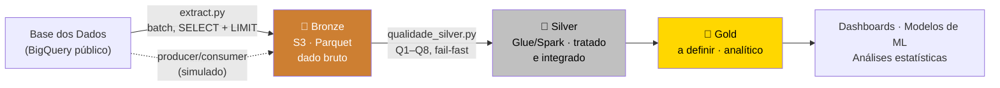
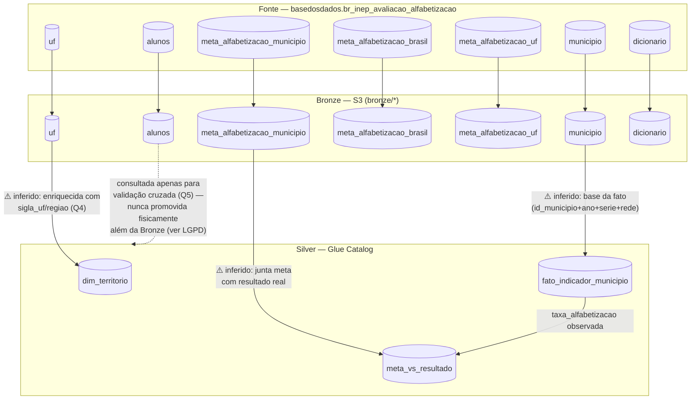

# Linhagem de Dados (Data Lineage)

> ⚠️ **STATUS: RASCUNHO** — A linhagem em nível de camada (Bronze → Silver → Gold)
> está confirmada pelo código já existente (`src/ingestion/extract.py`,
> `qualidade_silver.py`). Já a linhagem em nível de **tabela** dentro da Silver
> (quais colunas de `municipio`/`alunos`/`meta_alfabetizacao_municipio` viram
> quais colunas de `fato_indicador_municipio`/`dim_territorio`/`meta_vs_resultado`)
> foi **inferida** a partir das queries do `qualidade_silver.py` — precisa ser
> confirmada com quem escreveu `src/transformation/silver.py`, que é a fonte real
> dessa transformação.

Este documento atende dois requisitos ao mesmo tempo:
- o item de governança **"Mapeamento de Linhagem"** listado como pendência pelo grupo;
- o requisito do desafio de incluir **"diagrama da pipeline"** e **"fluxo de dados"** no README.

## 1. Visão geral por camada

**Gate de qualidade:** a promoção de Bronze → Silver só acontece se todas as regras
**bloqueantes** (Q1, Q2, Q3, Q4, Q5, Q8) do `qualidade_silver.py` passarem — é um
mecanismo *fail-fast*: dado ruim não avança, o Job falha e alerta antes de
contaminar a Silver. Regras de severidade *alerta* (Q6, Q7) não bloqueiam, só
registram no relatório.

## 2. Linhagem em nível de tabela

## 3. Notas de rastreabilidade por regra de qualidade

Cada regra bloqueante do `qualidade_silver.py` corresponde a uma aresta específica
desta linhagem — útil pra saber, quando uma regra falha, **qual transformação**
investigar:

| Regra | Aresta afetada |
|---|---|
| Q1 — Integridade referencial | `meta_vs_resultado` → `dim_territorio` |
| Q2 — Códigos como texto | `municipio` (Bronze) → `fato_indicador_municipio` (tipo da chave) |
| Q3 — Unicidade | dentro de `fato_indicador_municipio` |
| Q4 — Vínculo territorial | `uf` (Bronze) → `dim_territorio` |
| Q5 — Ponto de corte | `alunos` (Bronze) — validação cruzada, sem promoção física |
| Q8 — Conservação de volume | `municipio` (Bronze) → `fato_indicador_municipio` (contagem) |

## 4. LGPD e limite de propagação

Conforme detalhado no `DICIONARIO.md`, a tabela `alunos` contém a granularidade
mais sensível do projeto (registro por criança). A linha pontilhada no diagrama
acima é proposital: `alunos` é **consultada** pela Silver (para a checagem Q5),
mas **não é promovida** como tabela própria além da Bronze — a Silver e a Gold só
recebem agregados (`taxa_alfabetizacao`, contagens, percentuais).

## 5. Pendências

- [ ] Confirmar com quem escreveu `src/transformation/silver.py` se a linhagem
      inferida acima (setas com ⚠️) bate com a transformação real
- [ ] Confirmar se `meta_alfabetizacao_brasil` e `meta_alfabetizacao_uf` também
      alimentam `meta_vs_resultado`, ou se ficam restritas a análises futuras da Gold
- [ ] Atualizar este documento quando as tabelas de Gold forem definidas
      (`indicador_por_municipio`, `comparacao_meta_resultado`, `evolucao_temporal`
      — nomes sugeridos com base no PDF, ainda não implementados)